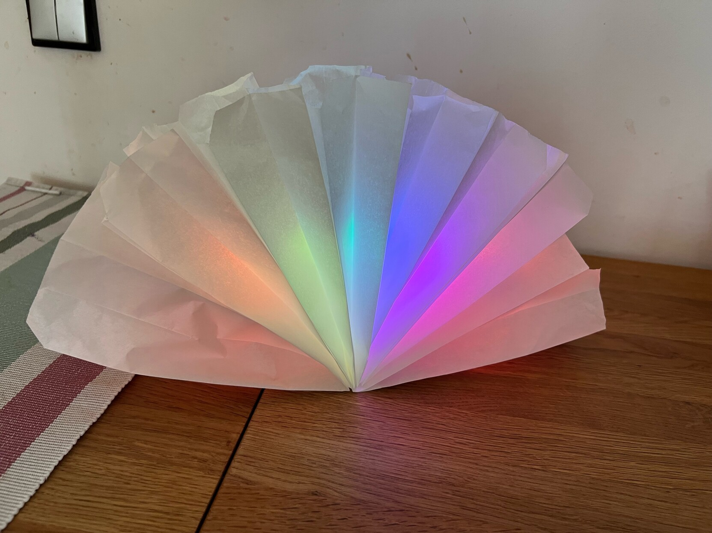

# 37c3 kidspace workshop: build your own LED lamp

To build your own, please refer to the PDF or PPTX files.

## parts

 - 8 paper sandwich bags (Butterbrotstüten)
 - ESP8266 board e.g. https://www.amazon.de/dp/B0CHNXTY13
   - Not all of these boards provide 5V on the 5V pin (which is intended primary for power supply) when the power supply is coming from the USB port. This one does, making it extremely convenient to connect the LED strips.
 - Any random LED strip with WS2812 LEDs @ 5V, for example, https://www.amazon.de/dp/B088BB8WTZ.
    - Strips with 30 LEDs per meter are an ideal fit for this project.
 - Some short cables
